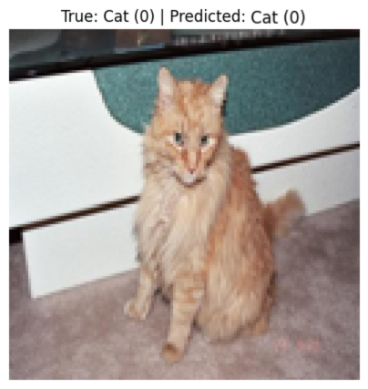

# Cats vs Dogs Classification using Classical Machine Learning

This project solves a binary image classification problem: classify an image as **Cat (0)** or **Dog (1)** using classical machine learning methods instead of CNNs.

## Project Overview

The classification pipeline is based on the following steps:

- HOG (Histogram of Oriented Gradients)
- LBP (Local Binary Patterns)
- Color Histograms
- StandardScaler
- PCA
- SVM

The goal was to design a complete image classification system using handcrafted features and a classical machine learning model.

## Experiments

Two experiments were conducted using different image sizes.

### Experiment 1 — 64×64 images
- Accuracy: **0.7808**
- Precision: **0.7897**
- Recall: **0.7657**
- F1-score: **0.7775**

### Experiment 2 — 128×128 images
- Accuracy: **0.8029**
- Precision: **0.8086**
- Recall: **0.7939**
- F1-score: **0.8012**

The **128×128 configuration** achieved the best performance and was selected as the final model.

## Files

- `notebook.ipynb` — implementation of the full machine learning pipeline
- `report.pdf` — project report
- `images/quick_test.png` — example of a quick prediction test

## Quick Test on a Validation Image

The notebook includes a quick visual test on one validation image to verify that the final prediction function works correctly on a single sample.

### Example Output



## Final Prediction Function

The final prediction function is:

```python
cats_dogs_classification(image)
